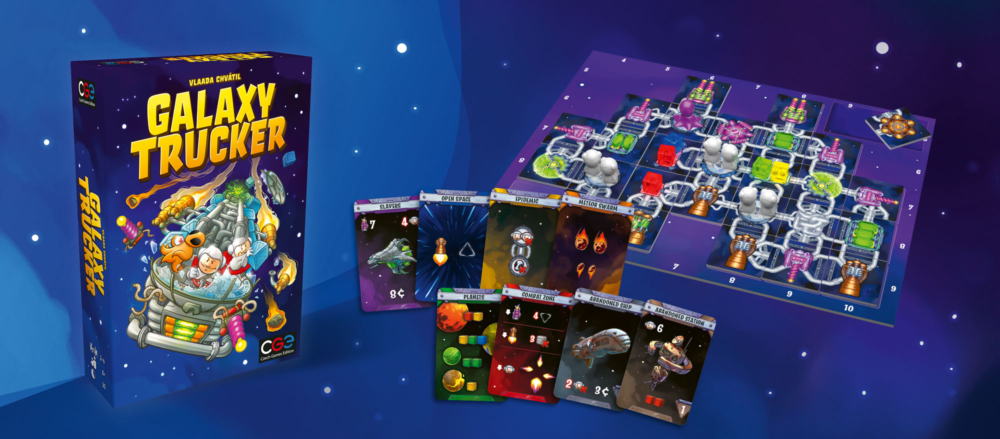
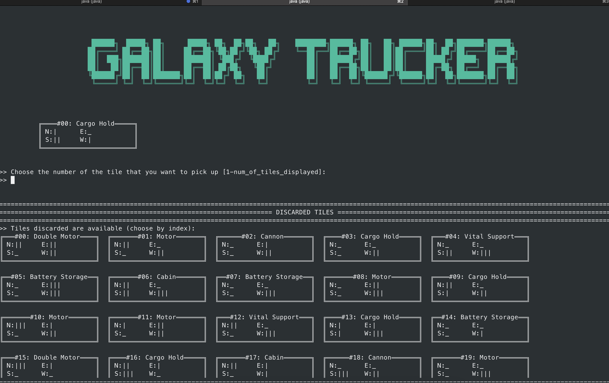
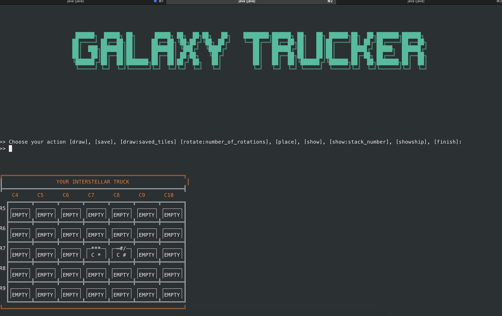
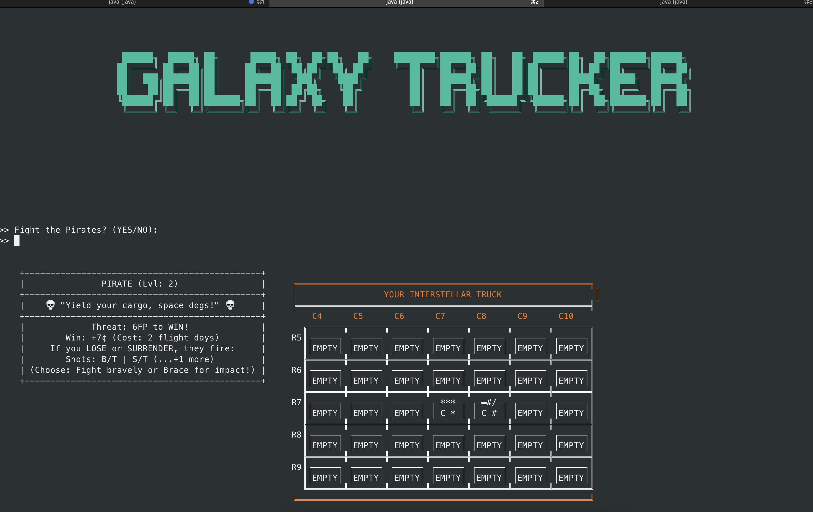

# Software Engineering Project - 2024-2025

## ⚠️ __Attention__: The files in the resources directory have been deleted as they were provided under a license agreement


This project __Galaxy Trucker__ is a video game inspired by the board game of the same name, where players take on the role of spaceship captains who must build, manage, and pilot their ships through a dangerous and unpredictable galaxy. The goal is to transport valuable cargo, survive threats such as asteroids, pirates, and aliens, and reach the destination with the ship as intact as possible.

The game is developed in Java, as a university project, aiming to demonstrate skills in object-oriented programming, user interface design, creation of tests, creation of UML diagrams and more.

## Documentation
### UML
You can find the High Level UMLs at [this folder](./resources/deliverables/highLevel_uml/).<br>
You can find the Detailed Level UML at [this folder](./resources/deliverables/detailedUml/).

### JavaDoc
The javadoc of this project can be found at [this folder](./resources/deliverables/javadoc/).

### Test Coverage
Our focus on testing was mainly on the Model side, but we made sure to test everything. Matter of facts, the lines of code used to test this project are about 10k 🚀.
The JUnit tests provide a line coverage of 99.8%, and we managed to test every class of the model.

### Tools
| Lib/Plugin    | Description           |
|---------------|-----------------------|
| __Maven__     | Build automation tool |
| __JavaFx__    | Java GUI Framework    |
| __JUnit__     | Testing Framework     |
| __PlanetUML__ | Design of the UML     |

## Features
| Feature                 | Status |
|-------------------------|--------|
| __Complete rules__      | ✅      |
| __TLI__                 | ✅      |
| __GUI__                 | ✅      |
| __Communication__       | ✅      |
| __Tutorial level__ | ✅      |

## Project structure
```shell
Galaxy_trucker_project/
│── pom.xml                           # Configuration file of Maven
│── README.md                         # File README.md
│── src/
│   ├── main/
│   │   ├── java/
│   │   │   ├── it.polimi.ingsoftware.ll13/
│   │   │   │   ├── client/
│   │   │   │   │   ├── controller/       # client controller
│   │   │   │   │   ├── handlers/         # view handlers
│   │   │   │   │   ├── view/             # GUI and TUI implementation
│   │   │   │   ├── network/              # Client-server communication
│   │   │   │   │   ├── connection/       # Ping pong implementation
│   │   │   │   │   ├── request/          # Requests form the client implementation
│   │   │   │   │   ├── response/         # Respones from the server to the client
│   │   │   │   ├── model/                # Game data models (e.g., cards, ship)
│   │   │   │   │   ├── .../              # Varius models
│   │   │   │   ├── server/               # Server implementation
│   │   │   │   │   ├── controller/       # Server controller implementation
│   │   │   │   ├── utils/                # Utility classes
│   │   ├── resources/                    # Resources (e.g., images, other files)
│   │   │   ├── cardboard/                # Images of the cardboards
│   │   │   ├── cards/                    # Images of the cards
│   │   │   ├── json/                     # Jsons for the generations of the objects
│   │   │   ├── tiles/                    # Images of the tiles
```

## Installation and Execution
1. Clone the repository:
   ```bash
   git clone git@github.com:Galimba03/IS25-LL13.git
   ```
2. Install Meaven if not installed yet.
3. Run this command:
   ```bash
   mvn clean package
   ```
4. After that, run the following command:
   - First start the server with:
   ```bash
   java -jar target/Galaxy_trucker_project-server-1.0-SNAPSHOT.jar [port_number]
   ```
   - Secondly, start the clients with:
   ```bash
   java -jar target/Galaxy_trucker_project-client-1.0-SNAPSHOT.jar
   ```

## CLI and GUI interfaces





## Contributing
If you'd like to contribute to the project, follow these steps:
1. Fork the repository.
2. Create a new branch for your feature (```git checkout -b feature/new-feature```).
3. Commit your changes (```git commit -m 'Add new feature'```).
4. Push the branch (```git push origin feature/new-feature```).
5. Open a Pull Request.

## Group members
- [__Boglioli Alessandro__](https://github.com/Alessandro-Boglioli)
- [__Galimberti Matteo__](https://github.com/Galimba03)
- [__Kumar Tanish__](https://github.com/Tanishkmr)

## License
This project is developed in collaboration with [Politecnico di Milano](https://www.polimi.it) and [Cranio Creations](http://www.craniocreations.it)
